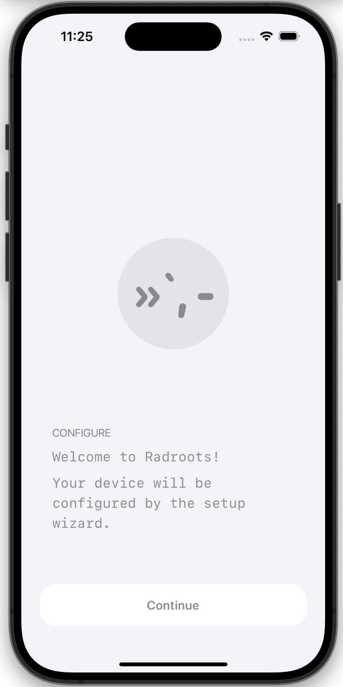

# tangle | rad roots

_a farmer's market app built on Nostr_

## Overview

Tangle is a decentralized social networking application built on the Nostr protocol. We are building it for farmers around the world to market their products, and share their activities and knowledge.

Built for adaptability to remote areas, Tangle is designed with offline-first principles and includes a local database and on-device geocoder. Upon network connection the application will synchronize local data to the Nostr network.

## Supported Features

- [x] Basic protocol flow description (NIP-01)
- [ ] Follow List (NIP-02)
- [ ] OpenTimestamps Attestations (NIP-03)
- [ ] Encrypted Direct Message (NIP-04)
- [ ] DNS Address (NIP-05)
- [ ] Mnemonic seed phrase (NIP-06)
- [ ] Event Deletion Request (NIP-09)
- [ ] Text Notes and Threads (NIP-10)
- [x] Relay Information Document (NIP-11)
- [ ] Private Direct Messages (NIP-17)
- [ ] Reposts (NIP-18)
- [ ] URI Scheme (NIP-21)
- [ ] Long-form Content (NIP-23)
- [ ] Reactions (NIP-25)
- [ ] User Status (NIP-38)
- [ ] Nostr Remote Signing (NIP-46)
- [ ] Nostr Wallet Connect (NIP-47)
- [ ] Lists (NIP-51)
- [ ] Live Activities & Live Chats (NIP-53)
- [ ] Lightning Zaps (NIP-57)
- [ ] Badges (NIP-58)
- [ ] Gift Wrap (NIP-59)
- [ ] Peer-to-peer Order events (NIP-69)
- [ ] Video Events (NIP-71)
- [ ] Moderated Communities (NIP-72)
- [ ] Polls (NIP-88)
- [ ] Recommended Application Handlers (NIP-89)
- [ ] Data Vending Machine (NIP-90)
- [ ] Media Attachments (NIP-92)
- [ ] HTTP File Storage Integration (NIP-96)
- [ ] HTTP Auth (NIP-98)
- [x] Classifieds (NIP-99)

## License

This code is released under a copyleft open-source license. We welcome all contributions. If you would like to provide feedback, suggest features, or contribute code, please refer to our [CONTRIBUTING.md](CONTRIBUTING.md) document.